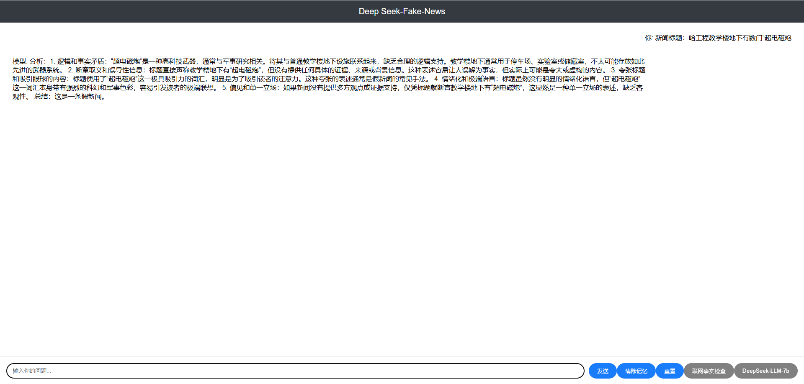

# Deep **<u>Seek</u>-<u>Fake</u>-<u>News</u>** LLM
<!-- markdownlint-disable first-line-h1 -->
<!-- markdownlint-disable html -->
<!-- markdownlint-disable no-duplicate-header -->

<div align="center">
  
</div>

<p align="center">
  <a href="https://huggingface.co/zt-ai/DeepSeekFakeNews-LLM-7B-Chat"><b>Project Link (Huggingface)</b>👁️</a>
  <a href="http://faculty.neu.edu.cn/tanzhenhua/zh_CN/index/100352/list/index.htm"><b>Lab Link</b>👁️</a>
</p>


### 1. Introduction of Deep **<u>Seek</u>-<u>Fake</u>-<u>News</u>** LLM

  
### 2. Model Summary
`deepseekfakenews-llm-7b-chat` is a 7B parameter model initialized from `deepseek-llm-7b-chat` and fine-tuned on the [fake news instruction dataset](https://drive.google.com/drive/folders/1PkOX11062v6bN7sjSw_qNJRrXE6um61o?usp=sharing) that we constructed based on the [MCFEND](https://github.com/TrustworthyComp) dataset.

- **Home Page:** [DeepSeekFakeNews](https://github.com/TAN-OpenLab/DeepSeekFakeNews-LLM)
- **Huggingface Repository:** [zt-ai/DeepSeekFakeNews-LLM-7B-Chat](https://huggingface.co/zt-ai/DeepSeekFakeNews-LLM-7B-Chat)
- **Demo of Chatting With DeepSeekFakeNews-LLM:

<div align="center">
  
</div>

### 3. How to Use
Here are some examples of how to use our model.

```python
import torch
from peft import PeftModel
from transformers import AutoTokenizer, AutoModelForCausalLM, GenerationConfig

model_name = "zt-ai/DeepSeekFakeNews-llm-7b-chat"
tokenizer = AutoTokenizer.from_pretrained(model_name)
model = AutoModelForCausalLM.from_pretrained(model_name)
model.generation_config = GenerationConfig.from_pretrained(model_name)
model.generation_config.pad_token_id = model.generation_config.eos_token_id
lora_model = PeftModel.from_pretrained(base_model, model_name)


messages = [
    {
"role": "user",
"content":
"""假新闻的表现可以总结为以下几个方面：1. 逻辑和事实矛盾。2.断章取义和误导性信息。3.夸张标题和吸引眼球的内容。4.情绪化和极端语言。5.偏见和单一立场。请从这几个方面分析新闻的真实性（真新闻或假新闻）：
发布时间：
新闻标题：
新闻内容：
"""}
]
input_tensor = tokenizer.apply_chat_template(messages, add_generation_prompt=True, return_tensors="pt")
outputs = model.generate(input_tensor.to(model.device), max_new_tokens=100)

result = tokenizer.decode(outputs[0][input_tensor.shape[1]:], skip_special_tokens=True)
print(result)
```

Avoiding the use of the provided function `apply_chat_template`, you can also interact with our model following the sample template. Note that `messages` should be replaced by your input.

```
User: {messages[0]['content']}

Assistant: 
```

**Note:** By default (`add_special_tokens=True`), our tokenizer automatically adds a `bos_token` (`<｜begin▁of▁sentence｜>`) before the input text. Additionally, since the system prompt is not compatible with this version of our models, we DO NOT RECOMMEND including the system prompt in your input.

### 4. Dataset 
The SEEK-FAKE-NEWS LLM is post-trained on the [fake news instruction dataset](https://drive.google.com/drive/folders/1PkOX11062v6bN7sjSw_qNJRrXE6um61o?usp=sharing) that we constructed based on the [MCFEND](https://github.com/TrustworthyComp) dataset.

### 5. Evaluation Results
| LLMs                     | F1.   | Acc.  |
|--------------------------|-------|-------|
| DeepSeek-LLM-7B-Chat     | 64.74 | 63.58 |
| DeepSeekFakeNews-LLM-7B-Chat | 84.17 | 84.48 |

## 6. Citation
```
@misc {tao_zhang_2025,
	author       = { {Tao Zhang} },
	title        = { DeepSeekFakeNews-LLM-7B-Chat (Revision ccc44ec) },
	year         = 2025,
	url          = { https://huggingface.co/zt-ai/DeepSeekFakeNews-LLM-7B-Chat },
	doi          = { 10.57967/hf/4631 },
	publisher    = { Hugging Face }
}

```

### 7. License
This code repository is licensed under the MIT License. The use of DeepSeekFakeNews-LLM models is subject to the Model License. DeepSeekFakeNews-LLM supports commercial use.

<!-- See the [LICENSE-MODEL](https://github.com/deepseek-ai/deepseek-LLM/blob/main/LICENSE-MODEL) for more details. -->

### 8. Contact

If you have any questions, please raise an issue or contact us at [zi4zhangt@gmail.com](mailto:zi4zhangt@gmail.com).
